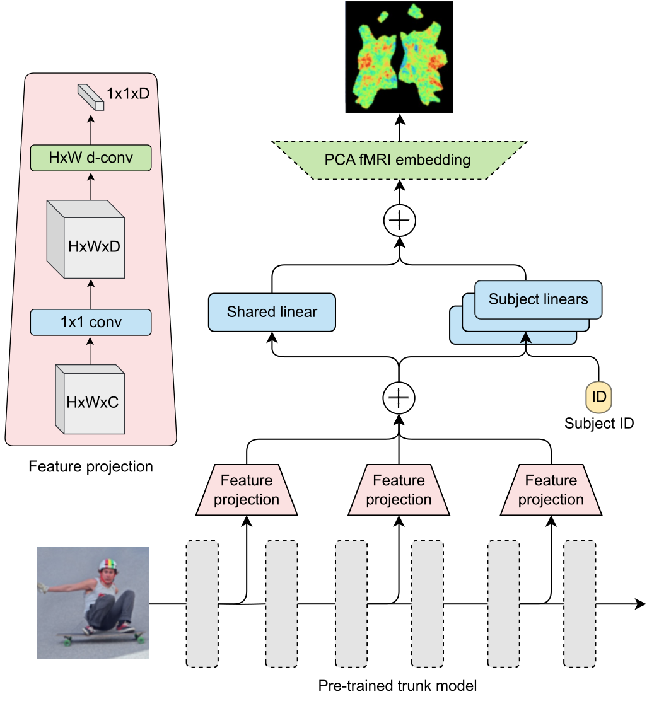

# Algonauts 2023

Code for the [CMI-DAIR submission](https://arxiv.org/abs/2308.02351) to the [Algonauts 2023 Challenge](http://algonauts.csail.mit.edu/) (team "BlobGPT").

<p align="center">
  
</p>

Our model consists of a multi-subject linear encoding head attached to a pretrained trunk model. The multi-subject head has three components: (1) a shared multi-layer feature projection, (2) shared plus subject-specific low-dimension linear transformations, and (3) a shared frozen PCA embedding. The feature projection is "factorized" as a 1x1 convolution followed by learned depthwise spatial pooling.

Our submission model used an `eva02_base_patch14_224.mim_in22k` trunk from [timm](https://github.com/huggingface/pytorch-image-models). We first trained the encoding head only with the trunk frozen (phase 1). Then we unfroze the trunk's attention blocks and fine-tuned the model end-to-end (phase 2). See [our report](https://arxiv.org/abs/2308.02351) for more details.

## Results

| Model | Val score | Test score | Config | Weights |
| --- | --- | --- | --- | --- |
| GroupLin-P1 | 20.4% | 58.8% | [config](config/phase1_head_only.yaml) | [weights](https://github.com/cmi-dair/algonauts23/releases/download/v0.1.0/grouplin_phase1.pt) |
| GroupLin-P2 | 20.9% | 60.3% | [config](config/phase2_finetune.yaml) | [weights](https://github.com/cmi-dair/algonauts23/releases/download/v0.1.0/grouplin_phase2.pt) |

**Val score**: median R<sup>2</sup> on our validation set

**Test score**: mean noise-normalized R<sup>2</sup> on official challenge test set

## Installation

Clone the repository.

```bash
git clone https://github.com/cmi-dair/algonauts23.git
```

Create a new environment.

```bash
cd algonauts23
python3.10 -m venv --prompt algonauts23 .venv
source .venv/bin/activate
pip install -U pip
```

Install the dependencies

```bash
pip install -r requirements.txt
```

Install the package

```bash
pip install .
```

## Dataset preparation

Follow the steps [here](dataset/) to download and prepare the data for training.

## Training

### WandB setup (optional)

We used [WandB](https://wandb.ai/) for experiment tracking. To set up WandB, create an account if you don't have one already and get your [API key](https://docs.wandb.ai/quickstart#common-questions). Then include these commands before launching training.

```bash
export WANDB_API_KEY="XXXXXXX"
wandb login
opts="--wandb"
```

### Download PCA weights

Our model uses a frozen group PCA embedding. You can download the weights [here](https://github.com/cmi-dair/algonauts23/releases/download/v0.1.0/group_pca_d-2048.pt).

You can also re-run the group PCA using [`scripts/fit_group_pca.py`](scripts/fit_group_pca.py).

### Phase 1: Multi-subject linear head only

In the first phase of training, we only train the multi-subject linear head with the trunk model frozen.

```bash
python scripts/train_group_encoder.py config/phase1_head_only.yaml \
    --out_dir results --workers 4 $opts
```

### Phase 2: Partial fine-tuning

Next, we partially fine-tune the full model starting from the best checkpoint from the first phase.

```bash
# Path to checkpoint
ckpt_run="PHASE1_RUN_NAME"
ckpt="results/algonauts23-group-encoder/${ckpt_run}/checkpoints/ckpt-best.pt"

python scripts/train_group_encoder.py config/phase2_finetune.yaml \
    --out_dir results --ckpt $ckpt --workers 4 $opts
```

## Submission

Run the [`zip_submission.sh`](scripts/zip_submission.sh) to prepare a zip file for submission to the [leaderboard](https://codalab.lisn.upsaclay.fr/competitions/9304).

```bash
./scripts/zip_submission.sh RESULT_DIR
```

## Acknowledgements

This code was built with elements and inspiration from [timm](https://github.com/huggingface/pytorch-image-models).

## Citation
If you find this repository helpful, please consider citing:

```
@article{lane2023algonauts,
  author  = {Connor Lane and Gregory Kiar},
  title   = {A Parameter-efficient Multi-subject Model for Predicting fMRI Activity},
  journal = {arXiv preprint arXiv:2308.02351},
  year    = {2023},
}
```
